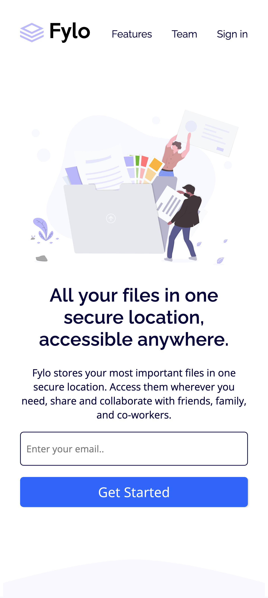

# Frontend Mentor - Fylo landing page with two column layout solution

This is a solution to the [Fylo landing page with two column layout challenge on Frontend Mentor](https://www.frontendmentor.io/challenges/fylo-landing-page-with-two-column-layout-5ca5ef041e82137ec91a50f5). Frontend Mentor challenges help you improve your coding skills by building realistic projects.

## Table of contents

- [Overview](#overview)
  - [The challenge](#the-challenge)
  - [Screenshot](#screenshot)
  - [Links](#links)
- [My process](#my-process)
  - [Built with](#built-with)
  - [What I learned](#what-i-learned)
  - [Useful resources](#useful-resources)
- [Author](#author)

## Overview

### The challenge

Users should be able to:

- View the optimal layout for the site depending on their device's screen size
- See hover states for all interactive elements on the page

### Screenshot

### Links

- Solution URL: [Github](https://github.com/rickyhewitt/frontendmentor-flylo#links)
- Live Site URL: [Netlify](https://guileless-rabanadas-573473.netlify.app/)

## My process

### Built with

- HTML5/CSS
- CSS Grid
- Mobile-first workflow

### Useful resources

- [css-tricks.com](https://css-tricks.com/snippets/css/complete-guide-grid/m)

## Author

- Website - [Ricky Hewitt](https://rickyhewitt.me)
- Frontend Mentor - [@rickyhewitt](https://www.frontendmentor.io/profile/rickyhewitt)
- Twitter - [@rickyhewitt_dev](https://www.twitter.com/rickyhewitt_dev)
