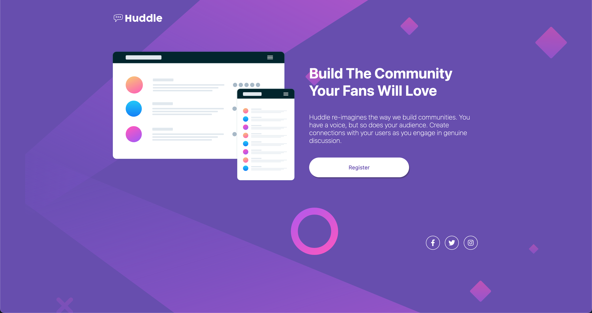

# Frontend Mentor - Huddle landing page with single introductory section solution

This is a solution to the [Huddle landing page with single introductory section challenge on Frontend Mentor](https://www.frontendmentor.io/challenges/huddle-landing-page-with-a-single-introductory-section-B_2Wvxgi0). Frontend Mentor challenges help you improve your coding skills by building realistic projects.

## Table of contents

- [Overview](#overview)
  - [The challenge](#the-challenge)
  - [Screenshot](#screenshot)
  - [Links](#links)
- [My process](#my-process)
  - [Built with](#built-with)
  - [What I learned](#what-i-learned)
  - [Continued development](#continued-development)
  - [Useful resources](#useful-resources)
- [Author](#author)

## Overview

### The challenge

Users should be able to:

- View the optimal layout for the page depending on their device's screen size
- See hover states for all interactive elements on the page

### Screenshot

### Links

- [Live URL](https://gleeful-yeot-221f74.netlify.app/)

## My process

### Built with

- CSS Flexbox
- Mobile-first workflow

### What I learned

Improved experience with flexbox

### Useful resources

- [css-tricks.com](https://css-tricks.com/snippets/css/a-guide-to-flexbox/) - Useful reference for flexbox

## Author

- Website - [Ricky Hewitt](https://rickyhewitt.me)
- Frontend Mentor - [@rickyhewitt](https://www.frontendmentor.io/profile/rickyhewitt)
- Twitter - [@rickyhewitt_dev](https://www.twitter.com/rickyhewitt_dev)
