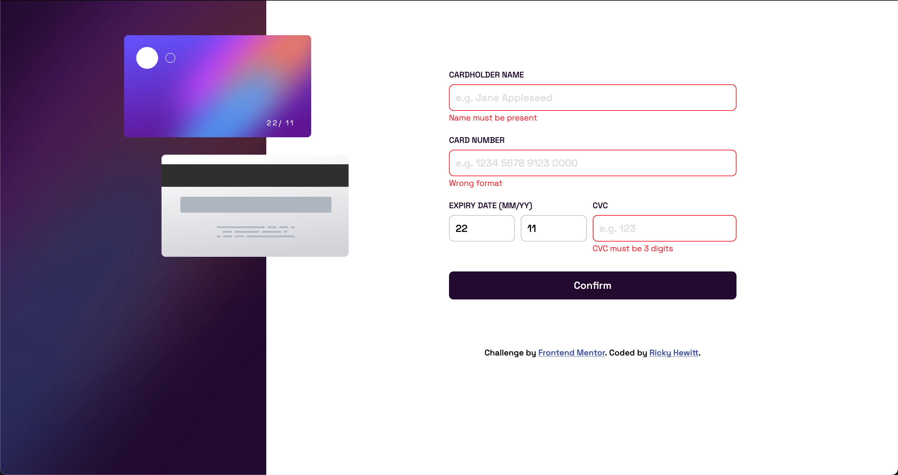
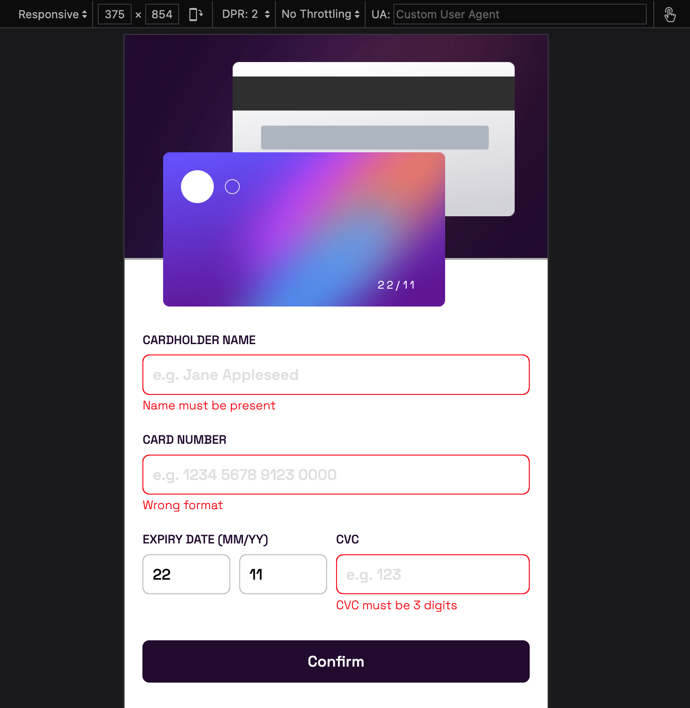

# Frontend Mentor - Interactive card details form solution

This is a solution to the [Interactive card details form challenge on Frontend Mentor](https://www.frontendmentor.io/challenges/interactive-card-details-form-XpS8cKZDWw). Frontend Mentor challenges help you improve your coding skills by building realistic projects.

## Table of contents

- [Overview](#overview)
  - [The challenge](#the-challenge)
  - [Screenshot](#screenshot)
  - [Links](#links)
- [My process](#my-process)
  - [Built with](#built-with)
  - [Continued development](#continued-development)
- [Author](#author)

**Note: Delete this note and update the table of contents based on what sections you keep.**

## Overview

### The challenge

Users should be able to:

- Fill in the form and see the card details update in real-time
- Receive error messages when the form is submitted if:
  - Any input field is empty
  - The card number, expiry date, or CVC fields are in the wrong format
- View the optimal layout depending on their device's screen size
- See hover, active, and focus states for interactive elements on the page

### Screenshot

### Links

- Solution URL: [frontendmentor.io](https://www.frontendmentor.io/solutions/interactive-card-details-b0Ath87z_s)
- Live Site URL: [inspiring-empanada-0a9da3.netlify.app](https://inspiring-empanada-0a9da3.netlify.app/)

## My process

### Built with

- HTML5/CSS/JS
- CSS Grid
- Mobile-first workflow

### Continued development

- Rewrite in react.js
- Improve form validation

## Author

- Website - [Ricky Hewitt](https://rickyhewitt.me)
- Frontend Mentor - [@rickyhewitt](https://www.frontendmentor.io/profile/rickyhewitt)
- Twitter - [@rickyhewitt_dev](https://www.twitter.com/rickyhewitt_dev)
