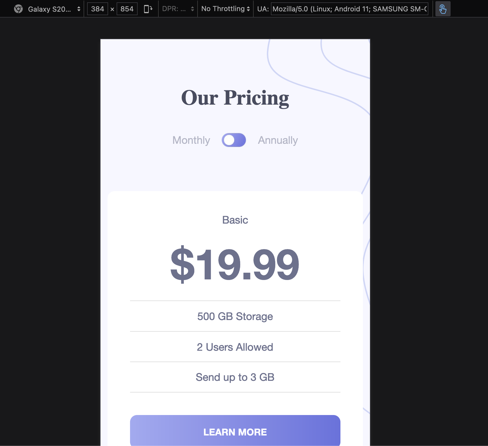
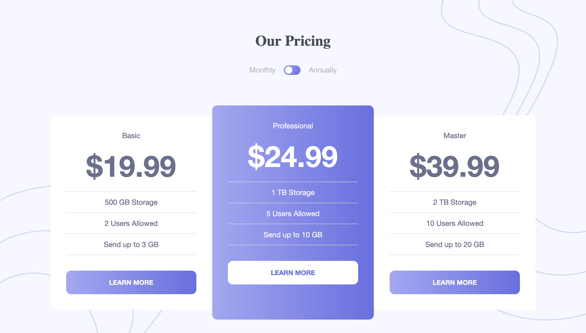

# Frontend Mentor - Pricing component with toggle solution

This is a solution to the [Pricing component with toggle challenge on Frontend Mentor](https://www.frontendmentor.io/challenges/pricing-component-with-toggle-8vPwRMIC). Frontend Mentor challenges help you improve your coding skills by building realistic projects.

## Table of contents

- [Overview](#overview)
  - [The challenge](#the-challenge)
  - [Screenshot](#screenshot)
  - [Links](#links)
- [My process](#my-process)
  - [Built with](#built-with)
  - [What I learned](#what-i-learned)
- [Author](#author)
- [Acknowledgments](#acknowledgments)

## Overview

### The challenge

Users should be able to:

- View the optimal layout for the component depending on their device's screen size
- Control the toggle with both their mouse/trackpad and their keyboard

### Screenshot




### Links

- Live Site URL: [Netlify](https://genuine-ganache-5ea951.netlify.app/)

## My process

### Built with

- HTML5, CSS, JS
- CSS Grid
- Mobile-first workflow

### What I learned

```css
img {
  transform: rotate(180deg);
}
```

## Author

- Website - [Ricky Hewitt](https://rickyhewitt.me)
- Frontend Mentor - [@rickyhewitt](https://www.frontendmentor.io/profile/rickyhewitt)
- Twitter - [@rickyhewitt_dev](https://www.twitter.com/rickyhewitt_dev)
